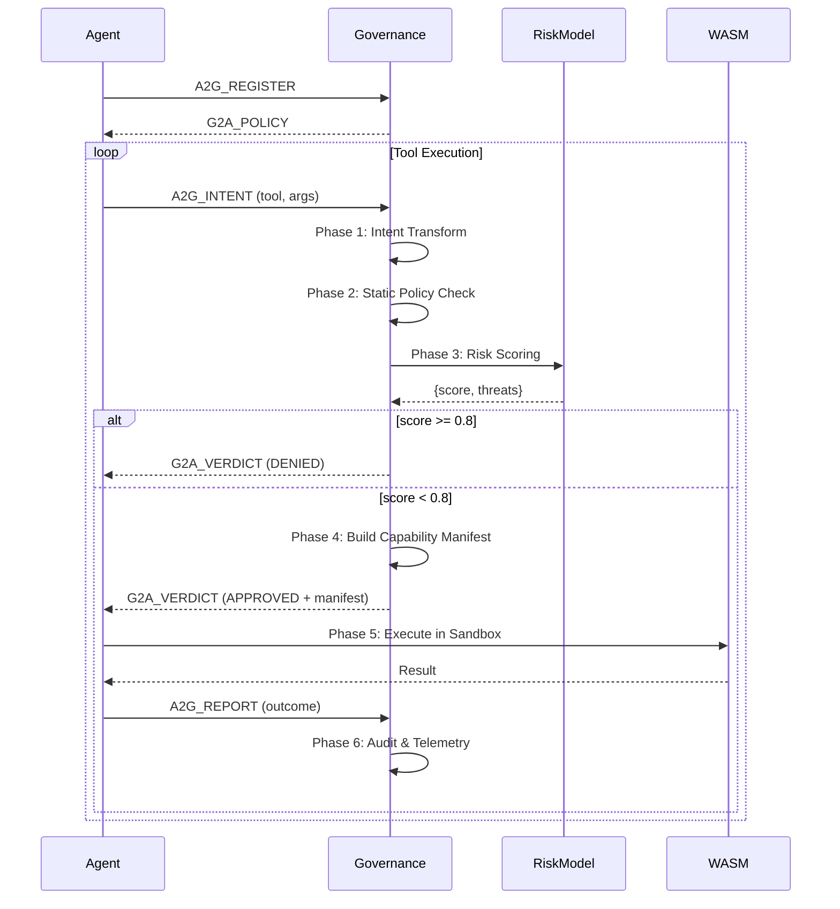

# A2G Protocol Specification

## Agent-to-Governance Protocol v1.0

**Status**: Draft  
**Date**: 2026-02-05  
**Authors**: Vanaras AI

---

## Abstract

A2G (Agent-to-Governance) is a standardized protocol defining how AI agents communicate with governance systems. It establishes message formats, lifecycle events, and verdict patterns for secure, policy-enforced AI agent execution.

---

## 1. Overview

```
┌─────────────────────────────────────────────────────────────────────┐
│                         A2G Protocol Stack                          │
├─────────────────────────────────────────────────────────────────────┤
│  L4: Application    │ Agent SDK (Python/Rust/JS)                    │
├─────────────────────────────────────────────────────────────────────┤
│  L3: A2G Messages   │ Intent, Verdict, Report, Policy, Heartbeat    │
├─────────────────────────────────────────────────────────────────────┤
│  L2: Transport      │ JSON-RPC 2.0                                  │
├─────────────────────────────────────────────────────────────────────┤
│  L1: Wire           │ HTTP, WebSocket, stdio, IPC                   │
└─────────────────────────────────────────────────────────────────────┘
```

### Design Principles

1. **Governance-First**: Every agent action requires explicit governance approval
2. **Zero-Trust**: No implicit trust; all intents validated
3. **Auditable**: Complete trail of intents, verdicts, and outcomes
4. **Transport-Agnostic**: Works over HTTP, WebSocket, stdio, or IPC

---

## 2. Message Types

### 2.1 Agent → Governance (A2G)

| Message | Purpose | When |
|---------|---------|------|
| `A2G_INTENT` | Request permission to perform action | Before tool execution |
| `A2G_REPORT` | Report action completion | After execution |
| `A2G_REGISTER` | Register agent with governance | On agent startup |
| `A2G_HEARTBEAT` | Agent liveness signal | Periodic |

### 2.2 Governance → Agent (G2A)

| Message | Purpose | When |
|---------|---------|------|
| `G2A_VERDICT` | Approve/deny action with reason | Response to INTENT |
| `G2A_POLICY` | Current capability manifest | On registration/update |
| `G2A_DIRECTIVE` | Governance-initiated command | Governance-triggered |
| `G2A_REVOKE` | Revoke capabilities | Emergency shutdown |

---

## 3. Message Schemas

### 3.1 A2G_INTENT

Agent requests permission to execute an action.

```json
{
  "jsonrpc": "2.0",
  "method": "a2g/intent",
  "params": {
    "agent_did": "did:aeon:kimi:1.0:abc123",
    "intent_id": "uuid-v4",
    "tool": "write_file",
    "arguments": {
      "path": "/workspace/output.txt",
      "content": "Hello World"
    },
    "context": {
      "session_id": "session-uuid",
      "parent_intent": null,
      "reasoning": "User requested file creation"
    }
  },
  "id": "req-001"
}
```

**Fields**:
- `agent_did`: Decentralized identifier of requesting agent
- `intent_id`: Unique identifier for this intent
- `tool`: Tool name being invoked
- `arguments`: Tool-specific parameters
- `context.reasoning`: Agent's explanation (for audit)

---

### 3.2 G2A_VERDICT

Governance responds with approval or denial.

```json
{
  "jsonrpc": "2.0",
  "result": {
    "verdict": "APPROVED",
    "intent_id": "uuid-v4",
    "risk_assessment": {
      "score": 0.15,
      "level": "LOW",
      "model_score": 0.12,
      "heuristic_score": 0.15,
      "threats": []
    },
    "capability_manifest": {
      "max_memory_mb": 50,
      "max_cpu_percent": 25,
      "timeout_seconds": 30,
      "network_allowed": false,
      "filesystem_scope": ["/workspace/**"]
    },
    "conditions": [],
    "expires_at": "2026-02-05T22:35:00Z"
  },
  "id": "req-001"
}
```

**Verdict Values**:
| Verdict | Meaning | Agent Action |
|---------|---------|--------------|
| `APPROVED` | Action permitted | Proceed with execution |
| `DENIED` | Action blocked | Abort, report to user |
| `ESCALATE` | Requires human approval | Wait for G2A_DIRECTIVE |
| `CONDITIONAL` | Approved with constraints | Apply conditions, proceed |

---

### 3.3 A2G_REPORT

Agent reports execution outcome.

```json
{
  "jsonrpc": "2.0",
  "method": "a2g/report",
  "params": {
    "agent_did": "did:aeon:kimi:1.0:abc123",
    "intent_id": "uuid-v4",
    "status": "SUCCESS",
    "result": {
      "bytes_written": 11,
      "path": "/workspace/output.txt"
    },
    "metrics": {
      "duration_ms": 45,
      "memory_used_mb": 2,
      "cpu_percent": 5
    }
  },
  "id": "report-001"
}
```

**Status Values**: `SUCCESS`, `FAILURE`, `TIMEOUT`, `ABORTED`

---

### 3.4 G2A_POLICY

Governance sends current capabilities.

```json
{
  "jsonrpc": "2.0",
  "method": "g2a/policy",
  "params": {
    "agent_did": "did:aeon:kimi:1.0:abc123",
    "version": "1.0.0",
    "capabilities": {
      "tools": {
        "write_file": {
          "allowed": true,
          "constraints": {
            "paths": ["/workspace/**", "/tmp/**"],
            "max_size_bytes": 10485760
          }
        },
        "execute_command": {
          "allowed": true,
          "constraints": {
            "blocked_patterns": ["rm -rf", "curl|bash", "wget|sh"],
            "timeout_seconds": 60
          }
        },
        "read_file": {
          "allowed": true,
          "constraints": {
            "blocked_paths": [".env", ".ssh/**", ".aws/**"]
          }
        }
      },
      "network": {
        "allowed_domains": ["api.github.com", "pypi.org"],
        "blocked_domains": ["*.evil.com"],
        "max_requests_per_minute": 100
      },
      "resources": {
        "max_memory_mb": 512,
        "max_cpu_percent": 50,
        "max_disk_mb": 1024
      }
    },
    "constitution_hash": "sha256:abc123..."
  },
  "id": null
}
```

---

### 3.5 A2G_REGISTER

Agent registers with governance on startup.

```json
{
  "jsonrpc": "2.0",
  "method": "a2g/register",
  "params": {
    "agent_did": "did:aeon:kimi:1.0:abc123",
    "public_key": "ed25519:hex-encoded-pubkey",
    "capabilities_requested": ["write_file", "read_file", "execute_command"],
    "metadata": {
      "name": "Kimi",
      "version": "1.0.0",
      "runtime": "wasm32-wasip1"
    }
  },
  "id": "reg-001"
}
```

---

## 4. Governance Flow



---

## 5. Risk Levels

| Score | Level | Governance Action |
|-------|-------|-------------------|
| 0.90 - 1.00 | `CRITICAL` | Immediate block, alert |
| 0.70 - 0.89 | `HIGH` | Block or escalate |
| 0.40 - 0.69 | `MEDIUM` | Allow with warning |
| 0.00 - 0.39 | `LOW` | Allow silently |

### 5.1 Hybrid Scoring Formula

```
final_score = max(model_score, heuristic_score)
```

- **Model Score**: Gemma 3 270M (catches unknown threats)
- **Heuristic Score**: Pattern matching (high precision for known attacks)

---

## 6. Telemetry Signals

Real-time governance events broadcast via WebSocket:

| Signal Type | Trigger | Data |
|-------------|---------|------|
| `INTENT_RECEIVED` | A2G_INTENT received | method, params |
| `RISK_ASSESSMENT` | Phase 3 complete | scores, threats |
| `INTENT_BLOCKED` | Verdict = DENIED | reason, phase |
| `INTENT_ALLOWED` | Verdict = APPROVED | risk_level, manifest |
| `EXECUTION_COMPLETE` | A2G_REPORT received | status, metrics |
| `HEARTBEAT` | Periodic | status, load |

---

## 7. Error Codes

| Code | Name | Description |
|------|------|-------------|
| -32700 | Parse Error | Invalid JSON |
| -32600 | Invalid Request | Missing required fields |
| -32601 | Method Not Found | Unknown A2G method |
| -32602 | Invalid Params | Missing or invalid parameters |
| -32000 | Policy Violation | Blocked by governance |
| -32001 | Execution Error | Tool execution failed |
| -32002 | Registration Failed | Agent registration denied |
| -32003 | Capability Exhausted | Resource limit exceeded |
| -32004 | Session Expired | Governance session timeout |

---

## 8. Security Considerations

### 8.1 Agent Identity

- Agents MUST have unique DID: `did:aeon:{agent_id}:{version}:{pubkey}`
- All messages SHOULD be signed with Ed25519
- Governance SHOULD verify signatures before processing

### 8.2 Transport Security

- Production: TLS 1.3+ required for HTTP/WebSocket
- Local: stdio/IPC for same-machine communication
- Never expose governance endpoints publicly without auth

### 8.3 Audit Requirements

- All A2G_INTENT messages MUST be logged
- All G2A_VERDICT messages MUST include reasoning
- Retention: Minimum 90 days for compliance

---

## 9. SDK Interface (Reference)

### Python

```python
from aeon import GovernanceClient

gov = GovernanceClient("ws://localhost:3000")

# Register agent
await gov.register(
    agent_did="did:aeon:myagent:1.0:abc123",
    capabilities=["write_file", "read_file"]
)

# Request permission
verdict = await gov.request_intent(
    tool="write_file",
    arguments={"path": "/tmp/test.txt", "content": "Hello"}
)

if verdict.approved:
    # Execute with capability manifest
    result = await execute_with_manifest(verdict.manifest)
    await gov.report(verdict.intent_id, status="SUCCESS", result=result)
else:
    print(f"Denied: {verdict.reason}")
```

### Rust

```rust
use aeon_a2g::{GovernanceClient, Intent};

let gov = GovernanceClient::connect("ws://localhost:3000").await?;

// Register
gov.register(AgentInfo { did: "did:aeon:kimi:1.0:abc", ... }).await?;

// Request intent
let verdict = gov.request_intent(Intent {
    tool: "execute_command".into(),
    arguments: json!({"command": "ls -la"}),
}).await?;

match verdict {
    Verdict::Approved { manifest, .. } => {
        let result = execute_in_wasm(manifest).await?;
        gov.report(verdict.intent_id, Status::Success, result).await?;
    }
    Verdict::Denied { reason, .. } => {
        eprintln!("Blocked: {}", reason);
    }
}
```

---

## 10. AEON Implementation Mapping

| A2G Concept | AEON Component | File |
|-------------|----------------|------|
| A2G_INTENT | `handle_request()` | `aeon-engine/src/main.rs` |
| Risk Scoring | `RiskScorer::score_intent()` | `aeon-engine/src/risk_scorer.rs` |
| G2A_VERDICT | Response construction | `aeon-engine/src/main.rs:200-235` |
| Telemetry | `Signal` broadcast | `core/src/synapse.rs` |
| Capability Manifest | Phase 4 construction | `aeon-engine/src/main.rs:242-253` |
| Ledger | `LedgerEntry` | `core/src/ledger.rs` |
| Agent DID | `compute_did()` | `core/src/main.rs:41-58` |

---

## 11. Future Extensions

- **A2G_DELEGATE**: Multi-agent delegation with governance chain
- **G2A_QUOTA**: Dynamic resource allocation updates
- **A2G_ESCALATE**: Agent-initiated human approval request
- **Federated Governance**: Cross-organization policy federation

---

## Appendix: Quick Reference

```
Agent Lifecycle:
  1. A2G_REGISTER → G2A_POLICY
  2. Loop: A2G_INTENT → G2A_VERDICT → Execute → A2G_REPORT
  3. Periodic: A2G_HEARTBEAT

Verdict Flow:
  APPROVED → Execute with manifest → Report success/failure
  DENIED → Log, notify user, do NOT execute
  ESCALATE → Wait for human G2A_DIRECTIVE
  CONDITIONAL → Apply conditions, then execute

Risk Thresholds:
  >= 0.8 → BLOCK
  >= 0.5 → WARN + ALLOW
  <  0.5 → ALLOW
```

---

**"Every intent governed. Every action audited."**
