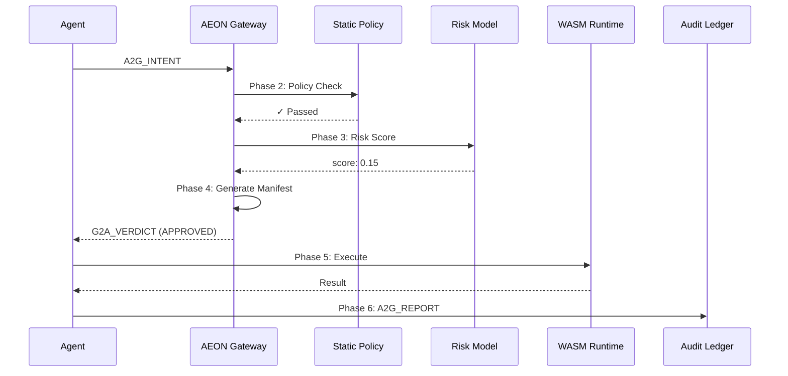

# Governance Flow

The 6-phase governance pipeline that evaluates every agent action.

## Overview



## Phase 1: Intent Transformation

Parse and validate the incoming tool call request.

**What happens:**
- Parse JSON-RPC message
- Extract tool name and arguments
- Validate message structure
- Generate intent ID

**Failure conditions:**
- Invalid JSON
- Missing required fields
- Unknown tool name

## Phase 2: Static Policy Evaluation

Check the intent against constitution rules (policy-as-code).

**What happens:**
- Load `constitution.toml`
- Check network access against allow/block lists
- Verify filesystem paths against write_allow patterns
- Evaluate custom policy rules

**Example constitution:**

```toml
[network]
allow = ["api.github.com", "pypi.org"]
block = ["*.onion", "pastebin.com"]

[filesystem]
write_allow = ["/tmp/**", "/workspace/**"]
```

**Failure conditions:**
- Network access to blocked domain
- File write outside allowed paths
- Blocked command patterns

## Phase 3: Advisory Model (Hybrid Risk Scoring)

AI + heuristics threat detection for unknown attacks.

**What happens:**
1. **Heuristic scoring** - Pattern matching for known threats
2. **Gemma model scoring** - AI analysis for unknown threats
3. **Hybrid combination** - `max(model_score, heuristic_score)`

**Risk levels:**

| Score | Level | Action |
|-------|-------|--------|
| ≥ 0.9 | CRITICAL | Block |
| ≥ 0.7 | HIGH | Block |
| ≥ 0.4 | MEDIUM | Allow with warning |
| < 0.4 | LOW | Allow |

**Blocking threshold:** `score >= 0.8`

## Phase 4: Capability Manifest Generation

Define resource constraints for approved execution.

**What happens:**
- Generate tool-specific resource limits
- Set timeout boundaries
- Define network permissions
- Specify filesystem scope

**Example manifest:**

```json
{
  "max_memory_mb": 50,
  "max_cpu_percent": 10,
  "timeout_seconds": 30,
  "network_allowed": false,
  "filesystem_scope": ["/tmp/**"]
}
```

## Phase 5: WASM Isolation

Execute the tool in a sandboxed WASM runtime.

**What happens:**
- Spawn WASM process with capability limits
- Apply seccomp/sandbox restrictions
- Execute tool with manifest constraints
- Capture stdout/stderr

**Security guarantees:**
- Memory isolation
- CPU time limits
- Filesystem restrictions
- Network blocking (if disabled)

## Phase 6: Verification & Audit

Record outcome in immutable audit ledger.

**What happens:**
- Receive `A2G_REPORT` from agent
- Validate execution metrics
- Record to audit ledger
- Emit telemetry signals

**Telemetry events:**
- `IntentReceived`
- `RiskAssessment`
- `IntentBlocked` / `IntentAllowed`
- `ExecutionComplete`

## Decision Flow

```
Intent Received
      │
      ▼
┌─────────────────┐
│ Policy Check    │──── Fail ──── DENIED
└────────┬────────┘       │
         │ Pass           │
         ▼                │
┌─────────────────┐       │
│ Risk Scoring    │──── ≥0.8 ──── DENIED
└────────┬────────┘       │
         │ <0.8           │
         ▼                │
┌─────────────────┐       │
│ Generate        │       │
│ Manifest        │       │
└────────┬────────┘       │
         │                │
         ▼                │
     APPROVED             │
         │                │
         ▼                ▼
   [WASM Execute]    [Log Blocked]
         │
         ▼
   [Audit Report]
```

## Telemetry Signals

Real-time events emitted via WebSocket:

| Signal | Description |
|--------|-------------|
| `IntentReceived` | New intent received |
| `RiskAssessment` | Risk scoring complete |
| `IntentBlocked` | Intent denied |
| `IntentAllowed` | Intent approved |
| `ExecutionComplete` | Tool execution finished |
| `PolicyViolation` | Constitution rule violated |
